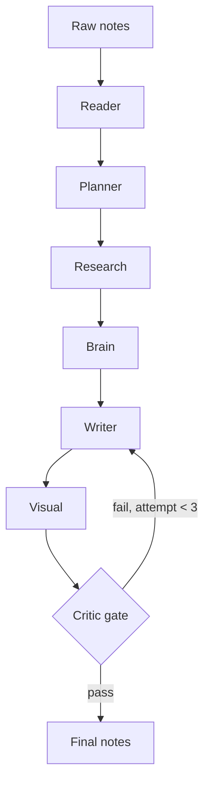

# notes-forge

Turn rough study notes into clear, correct, well-structured notes — with sources and diagrams.

You give it what you scribbled while learning something (text or a photo of handwritten notes).
It figures out what's missing or wrong, researches the gaps on the web, and rewrites the notes so
they still sound like **you** — just clearer.

## How it works

Seven agents, each with one job. Every agent returns JSON that is validated with pydantic
before it moves on, so a bad reply gets caught (and retried once) instead of silently
breaking the next step.



| Agent | Job |
|---|---|
| **Reader** | Understands the notes as written: topic, concepts, claims, open questions, your writing style. |
| **Planner** | Builds a prerequisite map, flags wrong/unverified claims, and writes research questions. |
| **Research** | Answers those questions with web search. No source, no fact. |
| **Brain** | Distils everything into the smallest set of ideas: one-liner, why, how, analogy, example. |
| **Writer** | Writes the notes in your voice, following a strict style guide. |
| **Visual** | One simple diagram per concept (Mermaid, a table, or an image prompt). |
| **Critic** | Four checks in parallel: fact & coverage, self-quiz, clarity/tone, diagrams. |

### The quality gate

```
pass = fact_score >= 8
    and quiz_correct >= 4 of 5
    and clarity_score >= 7
    and every visual passes
    and no unsupported claims
```

If a draft fails, the problems are merged into one numbered list (most severe first) and sent
back to the Writer (and the Visual agent for broken diagrams). After 3 attempts the best-scoring
draft ships with a **needs review** banner.

The self-quiz is the interesting part: one call writes 5 questions from the distilled knowledge,
a second call answers them using *only* the notes. Anything answered `NOT IN NOTES` becomes
feedback like "Notes do not explain: fast retransmit".

## Setup

```bash
python -m venv .venv && source .venv/bin/activate
pip install -e ".[dev]"
cp .env.example .env   # add your ANTHROPIC_API_KEY
```

Optional: install the Mermaid CLI so diagrams are actually rendered during review
(otherwise a lighter structural lint is used):

```bash
npm install -g @mermaid-js/mermaid-cli
```

## Usage

```bash
notes-forge run examples/tcp_notes.md
notes-forge run lecture-photo.jpg -o lecture.md
notes-forge lint-diagram diagram.mmd
```

Every run writes a folder under `runs/` with each agent's prompt, raw reply and parsed output,
plus the final `notes.md` and `feedback.txt`. When notes come out bad, that folder tells you
which agent went wrong.

## Configuration

| Env var | Default | Used by |
|---|---|---|
| `NOTES_FORGE_SMART_MODEL` | `claude-sonnet-5` | Planner, Research, Brain, Writer, Visual |
| `NOTES_FORGE_FAST_MODEL` | `claude-haiku-4-5` | Reader, Critic checks, Quiz |
| `NOTES_FORGE_RUNS_DIR` | `runs` | Run logs |

## Project layout

```
notes_forge/
  agents/        one module per agent
  prompts/       prompt templates ({{placeholders}})
  schemas.py     pydantic models for every agent output
  llm.py         API wrapper: JSON extraction, retry, run logging
  gate.py        merge rule + feedback builder
  diagrams.py    mermaid / table validation
  pipeline.py    orchestrator
  cli.py
```

## Tests

```bash
pytest
```

Tests cover everything that doesn't need a network call: schema validation, JSON extraction,
the retry loop (with a fake client), diagram linting, the merge rule and placeholder assembly.

## Roadmap

- Eval set: 20 real notes + hand-written "perfect" outputs, rerun after every prompt change
- Render Mermaid to SVG in an HTML export
- Streamlit UI with side-by-side before/after

## License

MIT
